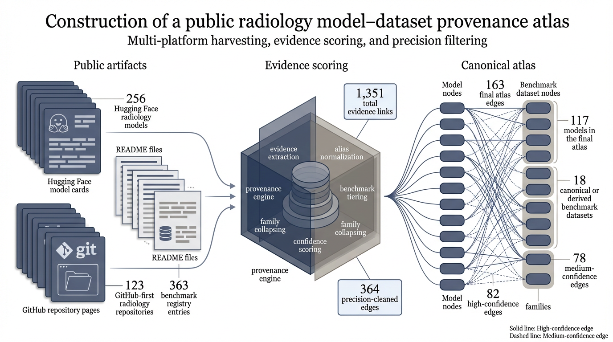

# Public Radiology AI Benchmark Provenance Atlas

A public resource linking open radiology AI models to canonical benchmark datasets using evidence recovered from Hugging Face and GitHub.

**Live app (free hosting):** deploy in ~2 minutes with [Streamlit Community Cloud](https://streamlit.io/cloud) — see **[DEPLOY.md](DEPLOY.md)**. After deploy, add your `https://….streamlit.app` link here and in the repo About URL.

## Atlas preview



## Overview

Public radiology AI models often mention datasets inconsistently across model cards, repository READMEs, and other public files. This makes it hard to understand which benchmark datasets actually anchor the visible open-model ecosystem.

This repository releases a benchmark-centered atlas of model–dataset provenance links for open radiology AI. The atlas was built by collecting public radiology AI models and repositories, normalizing benchmark dataset aliases, mining public text evidence across platforms, and assigning confidence scores to recovered model–dataset links.

This project is intended as both:
- a research resource for studying benchmark concentration and reuse in open radiology AI
- a practical lookup tool for navigating public model–dataset links

---

## Current Atlas Snapshot

| Metric | Count |
|---|---|
| Public models | 117 |
| Canonical/derived benchmark datasets | 18 |
| Final atlas edges | 163 |
| High-confidence edges | 82 |
| Medium-confidence edges | 78 |
| Low-confidence edges | 3 |

**Dominant benchmark families:** MIMIC · CheXpert · MRI · RadGraph

Secondary families include CT, mammography, VinDr, RaDialog, and others.

---

## Released Files

The main released files are located in `data/release/`.

### Main paper tables

- [`table1_family_summary.csv`](data/release/table1_family_summary.csv)  
  Benchmark family composition of the final atlas

- [`table2_dataset_summary.csv`](data/release/table2_dataset_summary.csv)  
  Canonical datasets represented in the final atlas

### Supplementary tables

- [`supplementary_table_s1_full_atlas_edge_list.csv`](data/release/supplementary_table_s1_full_atlas_edge_list.csv)  
  Full atlas edge list for the final paper atlas

- [`supplementary_table_s2_model_registry_in_atlas.csv`](data/release/supplementary_table_s2_model_registry_in_atlas.csv)  
  Model registry for all models represented in the final atlas

### Workbook

- [`atlas_tables_for_manuscript.xlsx`](data/release/atlas_tables_for_manuscript.xlsx)  
  Consolidated workbook containing the main manuscript tables and supplementary atlas tables

---

## How to use this repository

If you want to:

- browse benchmark families, start with [`table1_family_summary.csv`](data/release/table1_family_summary.csv)
- inspect individual canonical datasets, start with [`table2_dataset_summary.csv`](data/release/table2_dataset_summary.csv)
- analyze model–dataset links directly, use [`supplementary_table_s1_full_atlas_edge_list.csv`](data/release/supplementary_table_s1_full_atlas_edge_list.csv)
- review models included in the final atlas, use [`supplementary_table_s2_model_registry_in_atlas.csv`](data/release/supplementary_table_s2_model_registry_in_atlas.csv)

### Streamlit app (explorer + mind map)

**If you use Anaconda and see** `No module named 'numpy._core.multiarray'`: that happens because `streamlit run` is still using **Anaconda’s** Python (see the traceback path). Use the launcher so the app always runs in the repo’s **`.venv`**, not PATH:

```bash
cd /path/to/radiology-benchmark-provenance-atlas
chmod +x run_app.sh   # once
./run_app.sh
```

Or, without the script, call Streamlit **only** via the venv interpreter (never the global `streamlit` command until you’ve activated):

```bash
python3 -m venv .venv
.venv/bin/pip install --upgrade pip
.venv/bin/pip install -r requirements.txt
.venv/bin/python -m streamlit run app/app.py
```

The app includes a **Home** mind map (Plotly), **Datasets** / **Models** browsers, **Atlas map** (ring + bipartite), and **About**. Optional `.streamlit/pages.toml` sets sidebar labels (Streamlit ≥1.36). Requires **plotly** (see `requirements.txt`).

In Cursor/VS Code, set the interpreter to **`.venv/bin/python`** for this workspace, then run Streamlit from the integrated terminal (or use `./run_app.sh`).

Repair Anaconda only if you want base fixed: `pip install --force-reinstall "numpy>=1.26,<2.1" "pandas>=2"` (same env as broken numpy).

---

## Repository Contents

This repository provides four main outputs:

1. **Canonical benchmark registry** — Benchmark-centered representation of radiology datasets organized into canonical datasets, derived resources, and broader benchmark families.
2. **Model registry** — List of public models included in the final atlas.
3. **Evidence-scored atlas edge list** — Model–dataset links recovered from public sources, labeled by confidence and evidence type.
4. **Family-level and dataset-level summaries** — Aggregated views of the final atlas for manuscript reporting and downstream reuse.

---

## Methods Overview

The atlas was built using a multi-step public-source pipeline:

1. Build a radiology benchmark registry
2. Normalize canonical dataset names and aliases
3. Harvest radiology-relevant public models and repositories
4. Extract public text evidence from Hugging Face and GitHub
5. Match benchmark aliases in model cards, READMEs, and repository files
6. Aggregate evidence into candidate model–dataset links
7. Assign confidence scores based on evidence strength and source combinations
8. Collapse links into a benchmark-centered final atlas
9. Summarize the atlas at family and dataset level

See [`docs/methods_overview.md`](docs/methods_overview.md) for a concise description.

---

## Repository Structure
```text
radiology-benchmark-provenance-atlas/
├── data/
│   └── release/          # Released atlas tables
├── docs/                 # Methods, tiering, confidence, and data dictionary docs
├── figures/              # Current figure assets
├── notebooks/            # Notebook scaffold for reproducible build steps
├── src/                  # Code organization scaffold for the provenance pipeline
└── app/                  # Placeholder for the atlas explorer app
```

---

## Figures

Current figure assets are stored in `figures/`:

- [`Figure1.png`](figures/Figure1.png) — construction of the public provenance atlas
- [`Figure2.png`](figures/Figure2.png) — benchmark-centered map of open radiology AI
- [`Figure3.png`](figures/Figure3.png) — how the atlas can be used

---

## Interpretation

This atlas supports questions such as:
- Which benchmark datasets are most central in open radiology AI?
- Which public models are linked to a given benchmark?
- Which benchmark families dominate the visible ecosystem?
- Which model–dataset links are supported by stronger versus weaker public evidence?

The current atlas suggests that the public radiology AI ecosystem contracts to a relatively small benchmark-centered core once public provenance signals are cleaned and standardized.

---

## Limitations

This repository captures publicly recoverable provenance evidence, not definitive ground-truth training history for every model. A model–dataset link in this atlas means that public evidence supports a meaningful connection between the model and dataset — which may reflect training, evaluation, fine-tuning, benchmarking, reporting, or related documented use.

The atlas should be interpreted as an **evidence-weighted public provenance resource** rather than a complete ground-truth map of all dataset usage.

See [`docs/limitations.md`](docs/limitations.md) for more detail.

---

## Status

This repository contains the first public atlas release and accompanying manuscript-facing tables and figures.

**Planned next steps:**
- Add fuller reproducible pipeline code
- Release benchmark registry tables explicitly
- Build a lightweight searchable web explorer for the atlas

---

## Citation

Citation metadata is maintained in `CITATION.cff`. If you use this repository, please cite:
- the associated manuscript (once available)
- this repository release

---

## Contact

For questions, collaboration, or citation clarifications, please open an issue in this repository.
